# SignalLab Capture Gallery

The base gallery is generated by `tools/capture_index.py` so captures can be inspected visually on GitHub.
Each graph is the raw 10-bit GPIO35 waveform from `preview.svg`; programmatic summaries are shown only as helpers.

Manual raw-signal quality ratings from [`docs/initial-capture-analysis.md`](../docs/initial-capture-analysis.md):

 connected capture with sustained candidate waveform structure.
 connected capture with candidate segments but material signal-quality caveats.
 no-contact/unplugged negative control or false-positive test.
 not useful for waveform analysis, though it may remain useful as bad-signal data.

Regenerate after adding or editing captures:

```bash
python3 tools/capture_index.py
```

## 20260526-004055_ear_connected 

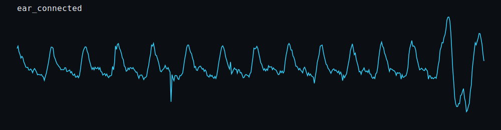

| Field | Value |
| --- | --- |
| Label | ear_connected |
| Started | 2026-05-26T00:40:55.071Z |
| Mode | browser-contact-sheet |
| Samples | 480 |
| Duration seconds | 9.989 |
| Raw min/max | 14/1023 |
| Raw p05/p95 | 355.6/730.0999999999999 |
| Range median | 623 |
| Clipping percent | 7.917 |
| Noise step p95 | - |
| Peak candidates | - |
| Status counts | FLOATING: 101, MOVING: 377, CLIPPING: 2 |
| Notes | - |
| Quality notes | - |

[raw.csv](20260526-004055_ear_connected/raw.csv) | [meta.json](20260526-004055_ear_connected/meta.json) | [summary.json](20260526-004055_ear_connected/summary.json)

## 20260526-004038_ear_connected 

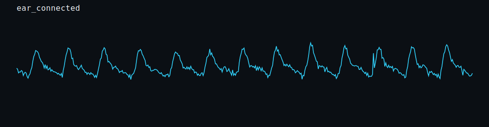

| Field | Value |
| --- | --- |
| Label | ear_connected |
| Started | 2026-05-26T00:40:38.389Z |
| Mode | browser-contact-sheet |
| Samples | 480 |
| Duration seconds | 9.991 |
| Raw min/max | 337/736 |
| Raw p05/p95 | 375.95/668 |
| Range median | 347 |
| Clipping percent | 0 |
| Noise step p95 | - |
| Peak candidates | - |
| Status counts | FLOATING: 120, GOOD WAVEFORM: 255, MOVING: 105 |
| Notes | - |
| Quality notes | - |

[raw.csv](20260526-004038_ear_connected/raw.csv) | [meta.json](20260526-004038_ear_connected/meta.json) | [summary.json](20260526-004038_ear_connected/summary.json)

## 20260526-004010_ear_connected 

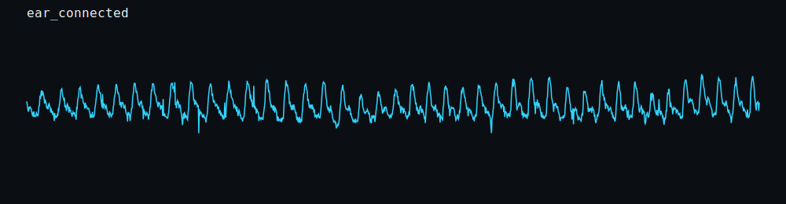

| Field | Value |
| --- | --- |
| Label | ear_connected |
| Started | 2026-05-26T00:40:10.819Z |
| Mode | browser-contact-sheet |
| Samples | 1440 |
| Duration seconds | 29.996 |
| Raw min/max | 300/701 |
| Raw p05/p95 | 392/633.05 |
| Range median | 362 |
| Clipping percent | 0 |
| Noise step p95 | - |
| Peak candidates | - |
| Status counts | FLOATING: 120, GOOD WAVEFORM: 821, MOVING: 499 |
| Notes | - |
| Quality notes | - |

[raw.csv](20260526-004010_ear_connected/raw.csv) | [meta.json](20260526-004010_ear_connected/meta.json) | [summary.json](20260526-004010_ear_connected/summary.json)

## 20260526-003844_ear_connected 

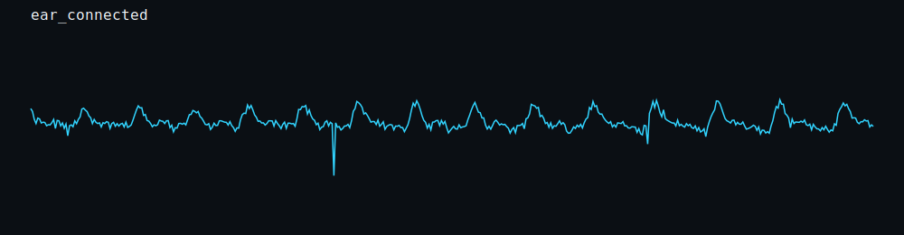

| Field | Value |
| --- | --- |
| Label | ear_connected |
| Started | 2026-05-26T00:38:44.186Z |
| Mode | browser-contact-sheet |
| Samples | 479 |
| Duration seconds | 9.984 |
| Raw min/max | 169/616 |
| Raw p05/p95 | 433/581 |
| Range median | 441 |
| Clipping percent | 0 |
| Noise step p95 | - |
| Peak candidates | - |
| Status counts | FLOATING: 120, GOOD WAVEFORM: 52, MOVING: 307 |
| Notes | - |
| Quality notes | - |

[raw.csv](20260526-003844_ear_connected/raw.csv) | [meta.json](20260526-003844_ear_connected/meta.json) | [summary.json](20260526-003844_ear_connected/summary.json)

## 20260526-003830_ear_connected 

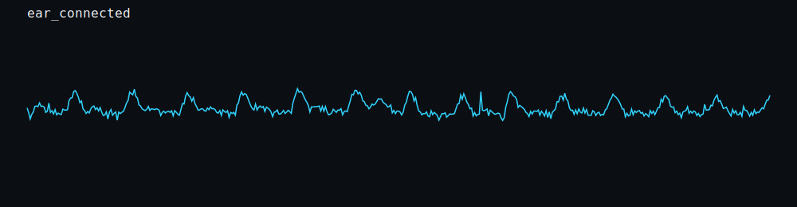

| Field | Value |
| --- | --- |
| Label | ear_connected |
| Started | 2026-05-26T00:38:30.842Z |
| Mode | browser-contact-sheet |
| Samples | 479 |
| Duration seconds | 9.986 |
| Raw min/max | 398/611 |
| Raw p05/p95 | 428/575.0999999999999 |
| Range median | 211 |
| Clipping percent | 0 |
| Noise step p95 | - |
| Peak candidates | - |
| Status counts | FLOATING: 120, GOOD WAVEFORM: 359 |
| Notes | - |
| Quality notes | - |

[raw.csv](20260526-003830_ear_connected/raw.csv) | [meta.json](20260526-003830_ear_connected/meta.json) | [summary.json](20260526-003830_ear_connected/summary.json)

## 20260526-003725_none_connected 

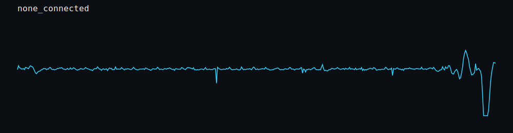

| Field | Value |
| --- | --- |
| Label | none_connected |
| Started | 2026-05-26T00:37:25.435Z |
| Mode | browser-contact-sheet |
| Samples | 479 |
| Duration seconds | 9.982 |
| Raw min/max | 0/679 |
| Raw p05/p95 | 445/507 |
| Range median | 182 |
| Clipping percent | 2.714 |
| Noise step p95 | - |
| Peak candidates | - |
| Status counts | FLOATING: 120, GOOD WAVEFORM: 345, MOVING: 9, CLIPPING: 5 |
| Notes | - |
| Quality notes | - |

[raw.csv](20260526-003725_none_connected/raw.csv) | [meta.json](20260526-003725_none_connected/meta.json) | [summary.json](20260526-003725_none_connected/summary.json)

## 20260526-003658_none_connected 

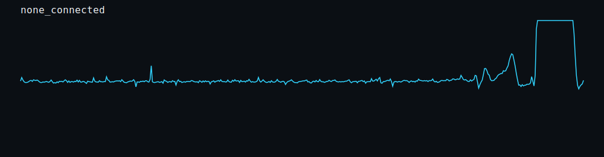

| Field | Value |
| --- | --- |
| Label | none_connected |
| Started | 2026-05-26T00:36:58.803Z |
| Mode | browser-contact-sheet |
| Samples | 479 |
| Duration seconds | 9.983 |
| Raw min/max | 420/1023 |
| Raw p05/p95 | 469.8/1023 |
| Range median | 186 |
| Clipping percent | 8.351 |
| Noise step p95 | - |
| Peak candidates | - |
| Status counts | FLOATING: 120, GOOD WAVEFORM: 318, MOVING: 1, CLIPPING: 40 |
| Notes | - |
| Quality notes | - |

[raw.csv](20260526-003658_none_connected/raw.csv) | [meta.json](20260526-003658_none_connected/meta.json) | [summary.json](20260526-003658_none_connected/summary.json)

## 20260526-003538_none_unplugged 

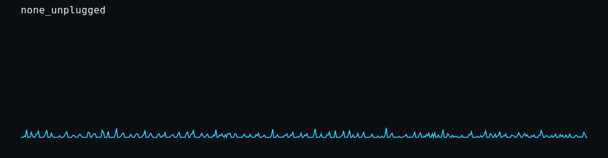

| Field | Value |
| --- | --- |
| Label | none_unplugged |
| Started | 2026-05-26T00:35:38.986Z |
| Mode | browser-contact-sheet |
| Samples | 480 |
| Duration seconds | 9.99 |
| Raw min/max | 0/84 |
| Raw p05/p95 | 0/46.049999999999955 |
| Range median | 80 |
| Clipping percent | 100 |
| Noise step p95 | - |
| Peak candidates | - |
| Status counts | NO SENSOR: 480 |
| Notes | - |
| Quality notes | - |

[raw.csv](20260526-003538_none_unplugged/raw.csv) | [meta.json](20260526-003538_none_unplugged/meta.json) | [summary.json](20260526-003538_none_unplugged/summary.json)

## 20260526-003522_none_unplugged 

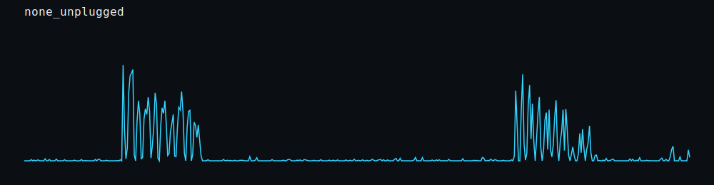

| Field | Value |
| --- | --- |
| Label | none_unplugged |
| Started | 2026-05-26T00:35:22.495Z |
| Mode | browser-contact-sheet |
| Samples | 479 |
| Duration seconds | 9.981 |
| Raw min/max | 0/717 |
| Raw p05/p95 | 0/383 |
| Range median | 717 |
| Clipping percent | 100 |
| Noise step p95 | - |
| Peak candidates | - |
| Status counts | NO SENSOR: 479 |
| Notes | - |
| Quality notes | - |

[raw.csv](20260526-003522_none_unplugged/raw.csv) | [meta.json](20260526-003522_none_unplugged/meta.json) | [summary.json](20260526-003522_none_unplugged/summary.json)

## 20260526-003429_none_connected 

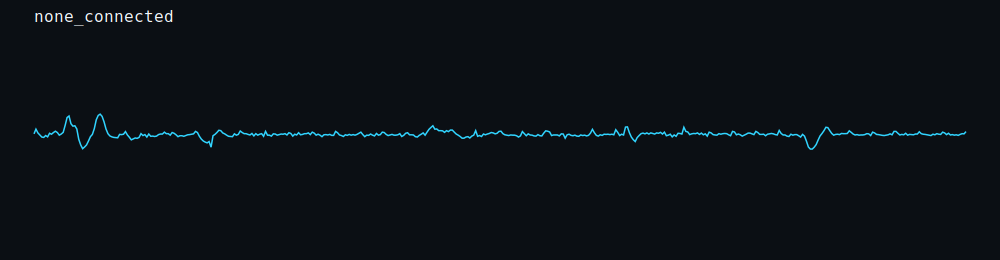

| Field | Value |
| --- | --- |
| Label | none_connected |
| Started | 2026-05-26T00:34:29.884Z |
| Mode | browser-contact-sheet |
| Samples | 480 |
| Duration seconds | 9.989 |
| Raw min/max | 410/596 |
| Raw p05/p95 | 467.95/515.05 |
| Range median | 184 |
| Clipping percent | 0 |
| Noise step p95 | - |
| Peak candidates | - |
| Status counts | FLOATING: 120, GOOD WAVEFORM: 360 |
| Notes | - |
| Quality notes | - |

[raw.csv](20260526-003429_none_connected/raw.csv) | [meta.json](20260526-003429_none_connected/meta.json) | [summary.json](20260526-003429_none_connected/summary.json)

## 20260526-003409_none_connected 

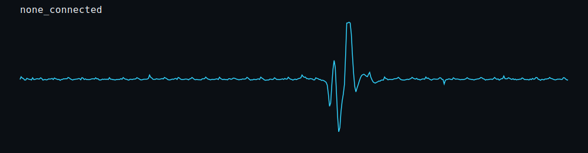

| Field | Value |
| --- | --- |
| Label | none_connected |
| Started | 2026-05-26T00:34:09.217Z |
| Mode | browser-contact-sheet |
| Samples | 479 |
| Duration seconds | 9.984 |
| Raw min/max | 11/1003 |
| Raw p05/p95 | 466.6/507.19999999999993 |
| Range median | 48 |
| Clipping percent | 0 |
| Noise step p95 | - |
| Peak candidates | - |
| Status counts | FLOATING: 120, GOOD WAVEFORM: 156, MOVING: 203 |
| Notes | - |
| Quality notes | - |

[raw.csv](20260526-003409_none_connected/raw.csv) | [meta.json](20260526-003409_none_connected/meta.json) | [summary.json](20260526-003409_none_connected/summary.json)

## 20260526-003311_finger_connected 

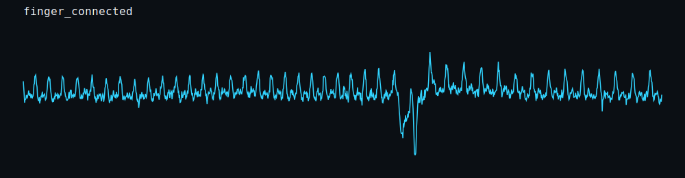

| Field | Value |
| --- | --- |
| Label | finger_connected |
| Started | 2026-05-26T00:33:11.494Z |
| Mode | browser-contact-sheet |
| Samples | 1439 |
| Duration seconds | 29.985 |
| Raw min/max | 0/799 |
| Raw p05/p95 | 416.9/620 |
| Range median | 291 |
| Clipping percent | 34.816 |
| Noise step p95 | - |
| Peak candidates | - |
| Status counts | FLOATING: 655, GOOD WAVEFORM: 782, CLIPPING: 2 |
| Notes | - |
| Quality notes | - |

[raw.csv](20260526-003311_finger_connected/raw.csv) | [meta.json](20260526-003311_finger_connected/meta.json) | [summary.json](20260526-003311_finger_connected/summary.json)

## 20260526-003149_finger_connected 

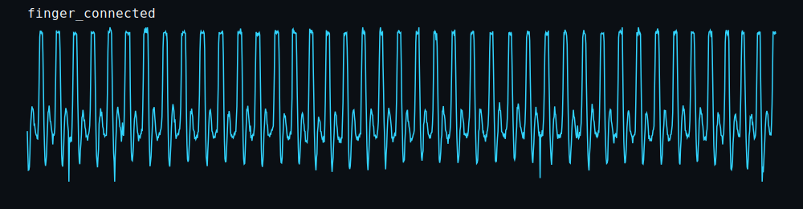

| Field | Value |
| --- | --- |
| Label | finger_connected |
| Started | 2026-05-26T00:31:49.712Z |
| Mode | browser-contact-sheet |
| Samples | 1440 |
| Duration seconds | 29.995 |
| Raw min/max | 0/1023 |
| Raw p05/p95 | 133.95/993 |
| Range median | 999 |
| Clipping percent | 94.444 |
| Noise step p95 | - |
| Peak candidates | - |
| Status counts | FLOATING: 80, CLIPPING: 11, MOVING: 1349 |
| Notes | - |
| Quality notes | - |

[raw.csv](20260526-003149_finger_connected/raw.csv) | [meta.json](20260526-003149_finger_connected/meta.json) | [summary.json](20260526-003149_finger_connected/summary.json)
