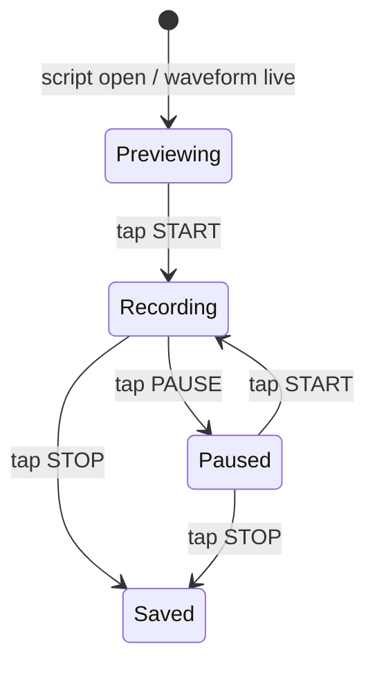

# SignalLab Capture Gallery

This page is generated by `tools/capture_index.py` so captures can be inspected visually on GitHub.
Each graph is the raw 10-bit GPIO35 waveform from `preview.svg`; programmatic summaries are shown only as helpers.

Regenerate after adding or editing captures:

```bash
python3 tools/capture_index.py
```

## Recorded So Far

**0 captures.**

There is no waveform to inspect yet. After a capture, each folder will appear below with its raw waveform graph.

## Recording Flow



- **Previewing**: CYD waveform is live, but no sample rows are being saved.
- **Recording**: sample rows are being saved into `raw.csv`.
- **Paused**: waveform is live, but sample rows are not being saved.
- **STOP**: ends the capture, writes files, and refreshes this gallery.

Run a screen-driven capture from the repo root:

```bash
python3 tools/capture.py --port /dev/cu.usbserial-10
```

When the CYD `STOP` button is tapped, this gallery will be refreshed automatically.

